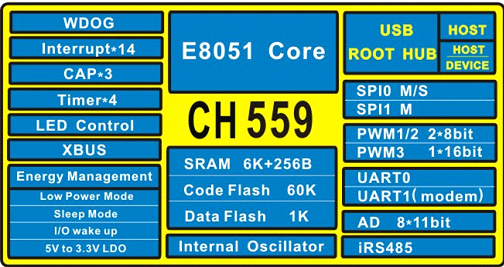

# [CH559](https://github.com/SoCXin/CH559)

#### [Vendor](https://github.com/SoCXin/Vendor)：[WCH](http://www.wch.cn/)
#### [Core](https://github.com/SoCXin/8051)：[8051](https://github.com/SoCXin/8051)
#### [Level](https://github.com/SoCXin/Level)：56MHz
## [简介](https://github.com/SoCXin/CH559/wiki)

[CH559](https://github.com/SoCXin/CH559)兼容MCS51的增强型E8051内核，79%指令是单字节单周期指令，3K BootLoader + 60K CodeFlash，6K xRAM + 256B iRAM，1K DataFlash。

内嵌USB控制器和双USB收发器，支持 USB-Host 主机模式和 USB-Device 设备模式，支持 USB 2.0 全速 12Mbps，USB 主机模式下可以通过双端口Root-HUB 同时管理两个USB设备。内置FIFO支持最大64字节数据包,支持 DMA。

接口包括内置类485数据收发器、LED控制卡接口和快速电平捕捉功能，其他包括2组SPI、2路串口、8位并口等，UART1兼容16C550；内置4组定时器；提供1路16位PWM和2路8位PWM；支持8通道10/11位ADC。

内置时钟和PLL，支持外部晶振。

#### 关键特性

* 5V->3.3V LDO
* 双USB收发器，USB主机模式下可以通过内嵌的双端口Root-HUB同时管理两个USB设备
* SPI x 2 + UART x 2 (FIFO/modem/16C550/iRS485)
* 8通道 1MSPS 10/11bit ADC
* 封装(LQFP48/SSOP20)

### [资源收录](https://github.com/SoCXin)

* [参考文档](docs/)
* [参考资源](src/)
* [参考工程](project/)

### [选型建议](https://github.com/SoCXin)

[CH559](https://github.com/SoCXin/CH559)

###  [探索芯世界 www.SoC.xin](http://www.SoC.Xin)
