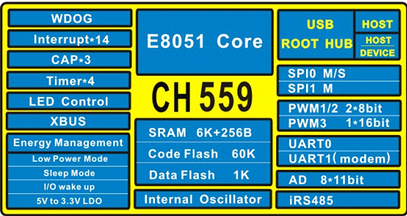

# [CH559](https://github.com/sochub/CH559) 

 

####  qitas@qitas.cn

#### 父级：[WCH-8051](https://github.com/sochub/WCH-8051) 
#### 归属：[MCS-51](https://github.com/sochub/MCS-51) 

## [简介](https://github.com/sochub/CH559/wiki)

CH559是一款兼容MCS51的增强型E8051内核单片机，79%的指令是单字节单周期指令，内置60K Code Flash，6K+256B Ram。于2015年初推出，具有很高的性价比。

CH559 内嵌USB控制器和双USB收发器，支持 USB-Host 主机模式和 USB-Device 设备模式，支持 USB 2.0 全速 12Mbps 或者低速 1.5Mbps，USB 主机模式下可以通过双端口 Root-HUB 同时管理两个 USB 设备。支持最大 64 字节数据包，内置 FIFO，支持 DMA。

CH559提供丰富的接口资源，包括内置类485数据收发器、LED控制卡接口和快速电平捕捉功能，其他包括2组SPI、2路串口、8位并口等，UART1兼容16C550；内置4组定时器；提供1路16位PWM和2路8位PWM；支持8通道10/11位ADC。

 

## [组成](https://github.com/sochub/CH559)

- [文档](docs/)
- [资源](src/)
- [工程](project/)

### [相似产品](https://github.com/sochub/WCH-8051)

- [CH558](https://github.com/sochub/CH554) 
- [CH554](https://github.com/sochub/CH554) 
- [CH552](https://github.com/sochub/CH552) 
- [CH551](https://github.com/sochub/CH551) 

- [CH57](https://github.com/sochub/CH57) 
- [CH56](https://github.com/sochub/CH56) 

##  [SoC开发平台](http://www.qitas.cn)  

